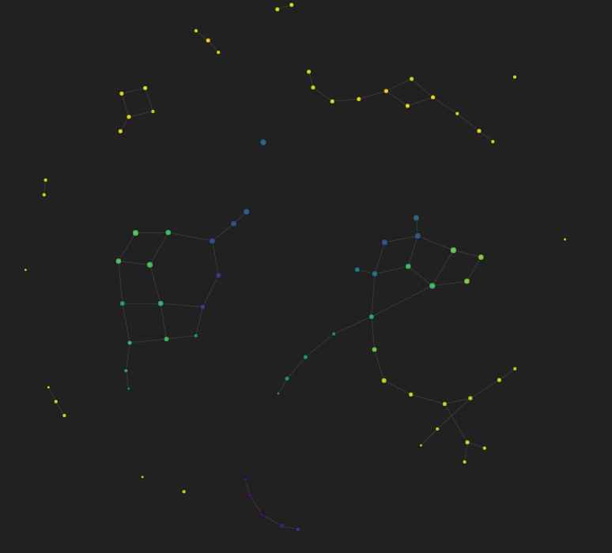

# Topological Data Analysis for Quantitative Bitcoin Trading (2013-2021)

## 1. Problematic

The cryptocurrency market, and specifically Bitcoin, is characterized by high volatility and complex price dynamics. Identifying robust patterns and trends is crucial for making informed trading decisions. Traditional statistical methods often fall short in capturing the intricate, nonlinear structures present in financial time series. This project aims to leverage **Topological Data Analysis (TDA)** to uncover hidden patterns, periodicities, and structural behaviors in Bitcoin's historical price data (2013-2021), ultimately supporting better quantitative trading strategies.

## 2. Methodology Implemented

The analysis follows a systematic approach, combining advanced time series processing with topological algorithms. The methodology is as follows:

### **A. Data Preparation and Feature Engineering**

- **Data Source:** Daily closing prices of Bitcoin from 2013 to 2021.
- **Feature Generation:**
  - **MA30:** 30-day moving average (monthly smoothing).
  - **STD30:** 30-day rolling standard deviation (volatility measure).
  - **Diff_MA30:** Difference between MA30 and the closing price.
  - **Diff_STD30:** Difference between STD30 and the closing price.
  - **Log_Return:** Daily logarithmic return.
  - **Rolling_Log_Return:** 30-day rolling sum of log returns.

These engineered features are designed to highlight both trend and volatility, providing a richer representation for topological analysis.

### **B. Visualization of Engineered Features**

Visualizations are created to inspect the behavior of the new features:

    

    

    

### **C. Takens Embedding**

To reconstruct the underlying phase space and reveal hidden periodicities, **Takens Embedding** is applied to the engineered features (`Diff_MA30` and `Diff_STD30`). Optimal hyperparameters (embedding dimension, delay, stride) are selected to maximize the quality of the embedding.

    

    

### **D. Persistent Homology (Vietoris-Rips Diagram)**

Persistent homology is computed using the **Vietoris-Rips complex** to detect topological features such as connected components and cycles, which correspond to trends and periodicities in the data.

    

    

### **E. Topological Mapper Algorithm**

The **Mapper algorithm** is used to cluster and visualize the high-dimensional structure of the data. Features (`Diff_MA30`, `Diff_STD30`, `Rolling_Log_Return`) are projected, clustered (KMeans), and visualized as a graph, revealing distinct regimes in the price dynamics.

    

### **F. Historical Price Coloring by Topological Clusters**

The clusters identified by the Mapper are mapped back to the original time series, coloring each point by its topological cluster to reveal the temporal structure of different market regimes.

    

## 3. Results and Conclusions

### **Periodicities**

- **Diff_MA30:** The Takens embedding and persistent homology reveal clear periodic structures, confirmed by off-diagonal points in the persistence diagram (homology group H1).
- **Diff_STD30:** While less visually obvious, persistent homology also detects periodicity, indicating underlying cyclical behavior in volatility.

### **Trend Detection**

- **Bullish Trends:** Certain clusters (e.g., Group 3) correspond to periods preceding major price surges (notably in 2018 and 2021), providing early signals of bullish momentum.
- **Bearish Trends:** Other clusters (e.g., Group 2) are associated with trend reversals and downward movements.
- **Sideways/Collateral Trends:** Clusters (e.g., Group 5) capture periods of consolidation or sideways movement, especially after breaking historical support/resistance levels.

### **Interpretation**

The Mapper algorithm successfully segments the time series into meaningful regimes, each with distinct topological signatures. This segmentation aligns with known market events and technical analysis concepts, demonstrating the power of TDA in financial time series analysis.

## 4. Comments and Improvements

### **Hyperparameter Optimization**

- A more systematic search for optimal Mapper parameters (number of cubes, overlap, projection functions) could further refine cluster detection.
- Experimenting with alternative clustering algorithms (e.g., DBSCAN, Agglomerative Clustering) may reveal additional structure.

### **Noise and Outlier Filtering**

- Applying filters (median, Hampel, wavelets) to reduce high-frequency noise and outliers could stabilize the topological features and improve interpretability.

### **Integration with Traditional Methods**

- Combining TDA with classical time series models (ARIMA, SARIMA) or machine learning approaches (Random Forest, XGBoost) could enhance predictive power.

### **Feature Expansion**

- Incorporating additional technical indicators (RSI, MACD, Bollinger Bands) and exogenous variables (volume, macroeconomic events) may enrich the analysis and improve cluster interpretability.

---

## 5. Final Remarks

This project demonstrates a comprehensive application of topological data analysis to Bitcoin price data, highlighting its potential for uncovering complex patterns and supporting quantitative trading decisions. The methodology and results showcase a strong interest and capability in advanced quantitative analysis, with clear avenues for further research and improvement.

## Repository Structure and Code Location

- The main analysis and code are in the notebook: **Problema1.ipynb**.
- All referenced images are in the `images` subfolder within the same directory.
